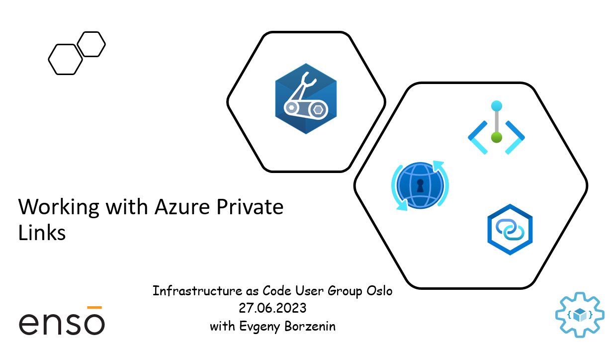

# Working with Azure Private Links

This is level 200 workshop that covers different aspects of working with [Azure Private Links](https://learn.microsoft.com/en-us/azure/private-link/private-link-overview) where you will learn:

- What is Azure Private Link
- What is Azure Private Endpoint
- How Azure Private Link, Azure Private Endpoint, and Azure Private Link service work together to create private connections to Azure resources
- When to use Azure Private Link
- How to configure DNS settings for private endpoints

and many more.

## Agenda

- Welcome + practical information
- Azure Azure Private Link overview (Slides)
- [Lab-01](labs/lab-01/index.md) - provisioning of lab resources
