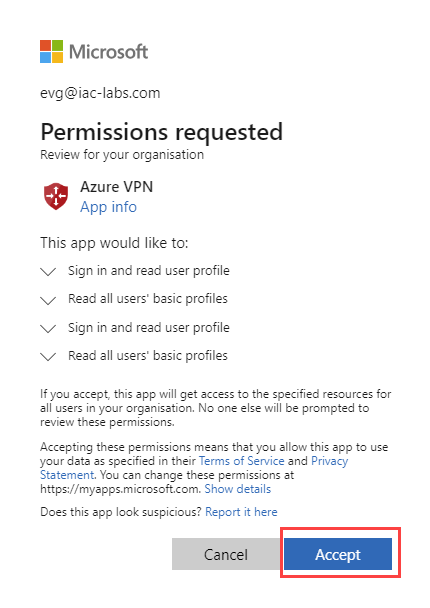
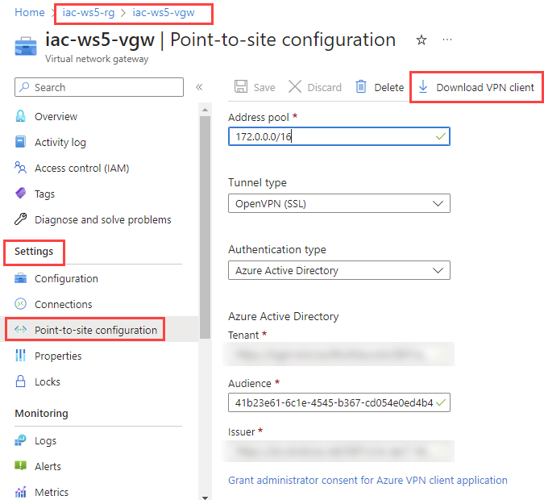
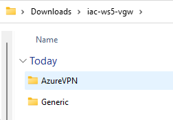
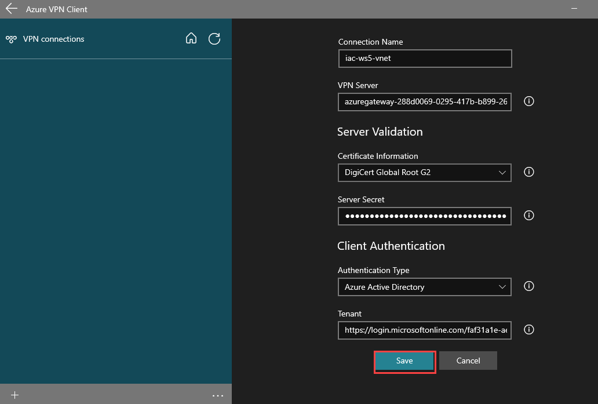
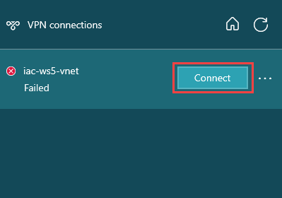
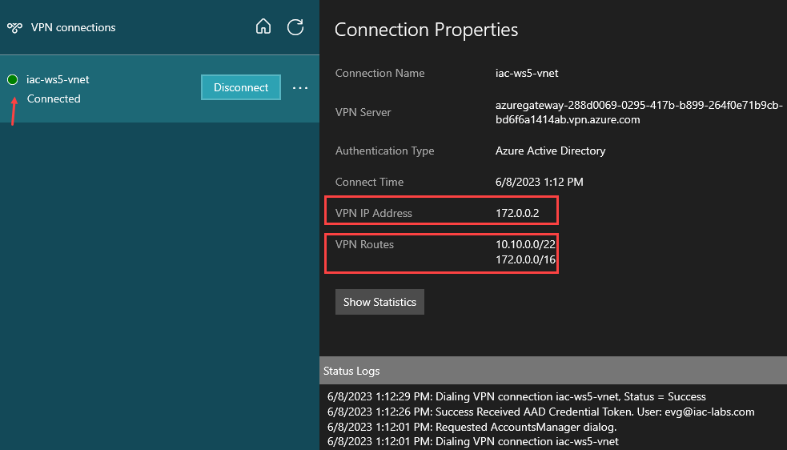
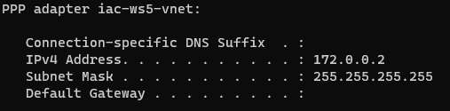
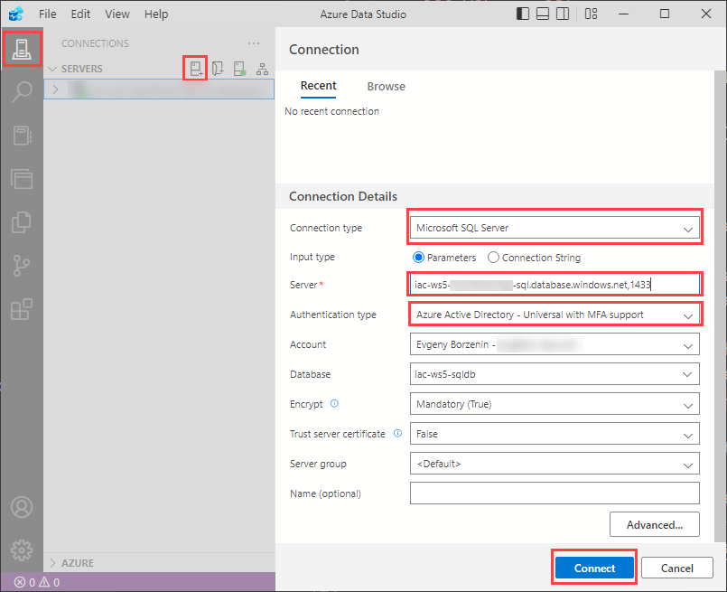
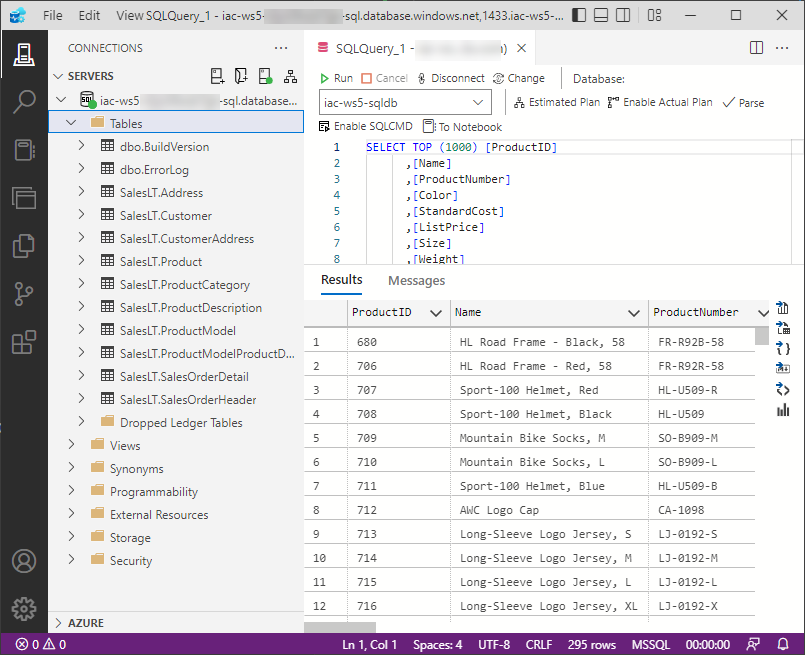

# lab-01 - provisioning of lab resources

As always, we need to provision lab environment before we can start working on the lab tasks. 

Infrastructure for Lab environment is implemented using `Bicep` and code is located under [iac](https://github.com/Infrastructure-AsCode/azure-private-links-labs/tree/main/iac) folder. Most of the resources are implemented as Bicep [modules](https://github.com/Infrastructure-AsCode/azure-private-links-labs/tree/main/iac/modules). The master orchestration Bicep file is [infra.bicep](https://github.com/Infrastructure-AsCode/azure-private-links-labs/blob/main/iac/infra.bicep). It orchestrates deployment of the following resources:

- Private Virtual Network
- Azure Cosmos DB
- Azure Storage Account

You can learn implementation details and code structure, but for the efficiency reasons, I pre-built Bicep code into ARM template and made it possible to deploy it right from Azure portal.

## Task #1 - Register required resource providers

Before we deploy lab resources, we need to register required resource providers. This is a one time operation per subscription.

```powershell
az provider register -n Microsoft.Network
az provider register -n Microsoft.OperationalInsights
az provider register -n Microsoft.Storage
az provider register -n Microsoft.Sql
az provider register -n Microsoft.DocumentDB
az provider register -n Microsoft.Compute
az provider register -n Microsoft.KeyVault
```

## Task #2 - Authorize the Azure VPN application

1. Sign in to the Azure portal as a user that is assigned the `Global administrator` role.
2. Grant admin consent for your organization. This allows the Azure VPN application to sign in and read user profiles. Copy and paste the URL that pertains to your deployment location in the address bar of your browser:

```txt
https://login.microsoftonline.com/common/oauth2/authorize?client_id=41b23e61-6c1e-4545-b367-cd054e0ed4b4&response_type=code&redirect_uri=https://portal.azure.com&nonce=1234&prompt=admin_consent
```



3. Select the account that has the `Global administrator` role if prompted.
4. On the `Permissions requested` page, select `Accept`.

## Task #3 - deploy lab resources

Now, let's deploy lab resources.

```powershell
# change directory to iac folder
cd iac

# Deploy Bicep master template
 ./deploy.ps1
```

Note! You will need to provide admin password for test VM!


!!! info "Estimated deployment time"
    35-40 minutes.

## Task #4 - configure Azure VPN client

First, check that Azure VPN client is installed on your machine. If not, download and install it from [here](https://www.microsoft.com/en-us/p/azure-vpn-client/9np355qt2sqb?activetab=pivot:overviewtab), or use `winget` (only for Windows users):

```powershell
winget install "azure vpn client"
```

Next, from Azure portal, download client profile configuration file for VPN Gateway we just provisioned. Go to your Virtual network gateway resource `iac-ws5-vgw` and click on `Download VPN client` file.



Extract `.zip` archive. It contains two folder:



Start Azure Vpn client and import `azurevpnconfig.xml` file from `AzureVPN` folder. It will create new VPN connection profile. 


When `azurevpnconfig.xml` file is loaded, click `Save`.



You will now see new VPN connection profile in Azure VPN client and you can now connect to it.



You will be asked to enter your Azure AD credentials and if everything is configured correctly, you will be connected to your Azure lab environment. Note, you will only need to provide your Azure AD credentials when you connect to VPN for the first time. Next time you will be connected automatically.



Under the `Connected properties` you can find what is your VPN IP Address and what VPN routes are available for you now. As you can see, our `iac-ws5-vnet` address range (`10.10.0.0/22`) is available for us now. You can find the same VPN IP Address if you run `ipconfig` command in your terminal.

```powershell
ipconfig
```



## Task #5 - test connectivity to test VM

Get test VM private IP address 

```powershell
# Get test VM private IP address
az vm list-ip-addresses -g iac-ws5-rg -n testVM --query [0].virtualMachine.network.privateIpAddresses[0] -otsv
```

Most likely, your IP will be `10.10.0.68`, but it can be different...

Make sure that Azure VPN is connected and use this IP and connect to test VM using RDP. Use `iac-admin` as username and password you provided during deployment.


You should be able to remote into test VM.


## Task #6 - test connectivity to SQL database

Start `Azure Data Studio`. If you haven't install it yet, download and install [Azure Data Studio](https://docs.microsoft.com/en-us/sql/azure-data-studio/download-azure-data-studio?view=sql-server-ver15&WT.mc_id=AZ-MVP-5003837) or install it with `winget` (Windows only).

```powershell
# Install SQL Management Studio with winget
winget install -e --id Microsoft.AzureDataStudio
``` 

Create a new connection to Azure SQL Server and use the following parameters:



| Parameter | Value |
| --- | --- |
| Connection type | Microsoft SQL Server |
| Input type | Parameters |
| Server | iac-ws5-sql.database.windows.net,1433 |
| Authentication type | Azure Active Directory - Universal with MFA support  |
| Account | Click `Add an account`, authenticate with your Azure AD account, and then select your account from the list  |
| Authentication type | Azure Active Directory - Universal with MFA support  |
| Database | Default or select iac-ws5-db  |

Keep all other parameters as default and click `Connect`.

You should now be connected to Azure SQL Server.




## Task #7 - test connectivity to Azure KeyVault

Test that you have access to Azure KeyVault. 

```powershell
# Get your keyvault name 
$keyVaultName = (az keyvault list --query [0].name -g iac-ws5-rg -otsv)

# Print keyvault name
$keyVaultName

# Insert new secret into keyvault
az keyvault secret set --vault-name $keyVaultName --name "foo" --value "bar"

# Get foo secret from keyvault
az keyvault secret show --vault-name $keyVaultName --name "foo" --query value -otsv
```