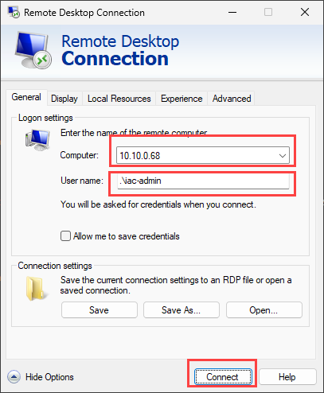

# lab-01 - provisioning of lab resources

As always, we need to provision lab environment before we can start working on the lab tasks. 

Infrastructure for Lab environment is implemented using `Bicep` and code is located under [iac](https://github.com/Infrastructure-AsCode/azure-private-links-labs/tree/main/iac) folder. Most of the resources are implemented as Bicep [modules](https://github.com/Infrastructure-AsCode/azure-private-links-labs/tree/main/iac/modules). The master orchestration Bicep file is [infra.bicep](https://github.com/Infrastructure-AsCode/azure-private-links-labs/blob/main/iac/infra.bicep). It orchestrates deployment of the following resources:

- Azure Resource Group `iac-ws5-rg` in `westeurope` region
- Azure Private Virtual Network `iac-ws5-vnet` with the following subnets:
    - `GatewaySubnet` - for Azure Virtual Network Gateway
    - `dnsresolver-inbound-snet` - for Azure DNS Private Resolver inbound endpoint 
    - `testvm-snet` - to deploy test VM 
    - `plinks-snet` - for Azure Private Endpoints
- Azure Virtual Network Gateway with Point-To-Site VPN configuration
- Azure SQL Server with `AdventureWorksLT` sample database. SQL Server is configured with Azure AD authentication and `iac-ws5-sql-administrators` Azure AD group is set as SQL Server administrators
- Azure Key Vault to further implement Private Endpoint for Azure Key Vault
- Azure Virtual Machine `testVM` (with nic and disk) for testing

## Task #1 - Register required resource providers

Before we deploy lab resources, we need to register required resource providers. This is a one time operation (per subscription).

```powershell
az provider register -n Microsoft.Network
az provider register -n Microsoft.OperationalInsights
az provider register -n Microsoft.Storage
az provider register -n Microsoft.Sql
az provider register -n Microsoft.Compute
az provider register -n Microsoft.KeyVault
```

## Task #2 - Authorize the Azure VPN application

1. Sign in to the Azure portal as a user that is assigned the `Global administrator` role.
2. Grant admin consent for your organization. This allows the Azure VPN application to sign in and read user profiles. Copy and paste the URL that pertains to your deployment location in the address bar of your browser:

```txt
https://login.microsoftonline.com/common/oauth2/authorize?client_id=41b23e61-6c1e-4545-b367-cd054e0ed4b4&response_type=code&redirect_uri=https://portal.azure.com&nonce=1234&prompt=admin_consent
```


3. Select the account that has the `Global administrator` role if prompted.
4. On the `Permissions requested` page, select `Accept`.

## Task #3 - deploy lab resources

Now, let's deploy lab resources.

First, clone the repo. If you use SSH, use the following command:

```powershell
git clone git@github.com:Infrastructure-AsCode/azure-private-links-labs.git
```

If you use HTTPS, use the following command:

```powershell
git clone https://github.com/Infrastructure-AsCode/azure-private-links-labs.git
```

```powershell
# change directory to iac folder
cd .\azure-private-links-labs\iac\

# Deploy Bicep master template
.\deploy.ps1
```

Note! You will need to provide admin password for test VM. Note that supplied password must be between 8-123 characters long and must satisfy `at least 3` of password complexity requirements from the following:

- Contains an uppercase character
- Contains a lowercase character
- Contains a numeric digit
- Contains a special character
- Control characters are not allowed

For example, `FooBar123!` is valid password :)


The `deploy.ps1` script does the following things:

- it creates new Azure AD Group called `iac-ws5-sql-administrators`
- it gets your signed in user object id and adds it to `iac-ws5-sql-administrators` group (you will be SQL Server admin)
- it gets your egress public IP address (by calling `https://ifconfig.me/ip`)
- it asks you for test VM admin password
- it deploys `iac/infra.bicep` Bicep template at the current subscription scope with parameters collected above (`signedInUserId`, `sqlAdminsGroupName`, `sqlAdminsGroupObjectId`, `homeIP`)

!!! info "Estimated deployment time"
    Because of Azure Virtual Network Gateway, deployment takes approx. 35-40 minutes.

If deployment of Virtual Machine failed, most likely it's because of the password complexity requirements. Check the error message, use different password and rerun deployment script again. It will only deploy resources that failed to deploy.

## Task #4 - configure Azure VPN client

Check that Azure VPN client is installed on your machine. If not, download and install it from [here](https://www.microsoft.com/en-us/p/azure-vpn-client/9np355qt2sqb?activetab=pivot:overviewtab), or use `winget` (only for Windows users):

```powershell
winget install "azure vpn client"
```

Next, from Azure portal, download client profile configuration file for VPN Gateway we just provisioned. Go to your Virtual network gateway resource `iac-ws5-vgw` and click on `Download VPN client` file.


Extract `.zip` archive. It contains two folder:


Start Azure Vpn client and import `azurevpnconfig.xml` file from `AzureVPN` folder. It will create new VPN connection profile. 


When `azurevpnconfig.xml` file is loaded, click `Save`.


You will now see new VPN connection profile in Azure VPN client and you can connect to it.


You will be asked to enter your Azure AD credentials and if everything is configured correctly, you will be connected to your Azure lab environment. Note, you will only need to provide your Azure AD credentials when you connect to VPN for the first time. Next time you will be connected automatically.


Under the `Connected properties` you can find what is your VPN IP Address and what VPN routes are available. As you can see, our `iac-ws5-vnet` address range (`10.10.0.0/22`) is accessible. You can find the same VPN IP Address if you run `ipconfig` command in your terminal.

```powershell
ipconfig
```


## Task #5 - test connectivity to testVM

Get your testVM private IP address 

```powershell
az vm list-ip-addresses -g iac-ws5-rg -n testVM --query [0].virtualMachine.network.privateIpAddresses[0] -o tsv
```

Make sure that Azure VPN is connected, use this IP and connect to testVM using RDP. Use `iac-admin` as username (if you haven't change it) and use password you provided during deployment.



You should now be able to remote into testVM.

## Task #6 - configure testVM

While you are at testVM, download and install latest version of `az cli` from [this link](https://docs.microsoft.com/en-us/cli/azure/install-azure-cli?view=azure-cli-latest&WT.mc_id=AZ-MVP-5003837)

When installed, open PowerShell and login to your azure account by running:

```powershell
az login
```

Check that you logged in and that your active subscription is the correct one (if you have more than one subscription):

```powershell
az account show
```

## Task #7 - test connectivity to SQL database

Start `Azure Data Studio`. If you haven't install it yet, download and install [Azure Data Studio](https://docs.microsoft.com/en-us/sql/azure-data-studio/download-azure-data-studio?view=sql-server-ver15&WT.mc_id=AZ-MVP-5003837) or install it with `winget` (Windows only).

```powershell
winget install -e --id Microsoft.AzureDataStudio
``` 

SQL logical server names are globally unique, so we all have different SQL server names. Let's get your SQL server name:

```powershell
az sql server list -g iac-ws5-rg --query [0].name -o tsv
```

!!! info "SQL Server name"
    Further down in all labs, you should replace `YOUR-SQL-SERVER-NAME` with value you received from the command above. It will looks something like `iac-ws5-...-sql`


Create a new connection to Azure SQL Server and use the following parameters:


| Parameter | Value |
| --- | --- |
| Connection type | Microsoft SQL Server |
| Input type | Parameters |
| Server | YOUR-SQL-SERVER-NAME.database.windows.net,1433 |
| Authentication type | Azure Active Directory - Universal with MFA support  |
| Account | Click `Add an account`, authenticate with your Azure AD account, and then select your account from the list  |
| Database | Default or select `iac-ws5-sqldb`  |

Keep remaining parameters as default and click `Connect`. You should now be connected to Azure SQL Server.


## Task #8 - test connectivity to Azure KeyVault

Test that you have access to Azure KeyVault. 

```powershell
# Get your keyvault name 
$keyVaultName = (az keyvault list --query [0].name -g iac-ws5-rg -otsv)

# Print keyvault name
$keyVaultName

# Insert new secret into keyvault
az keyvault secret set --vault-name $keyVaultName --name "foo" --value "bar"

# Get foo secret from keyvault
az keyvault secret show --vault-name $keyVaultName --name "foo" --query value -otsv

# Get all secrets
az keyvault secret list --vault-name $keyVaultName
```