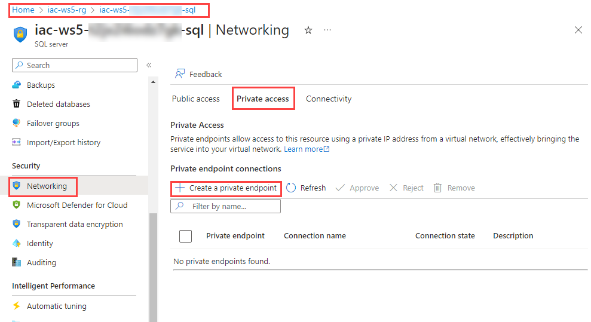
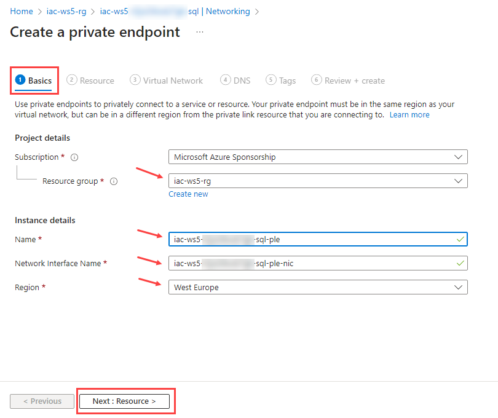
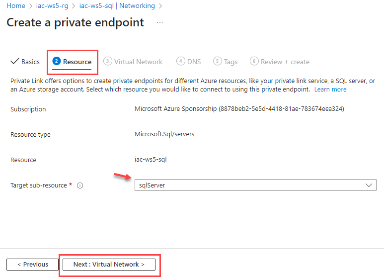
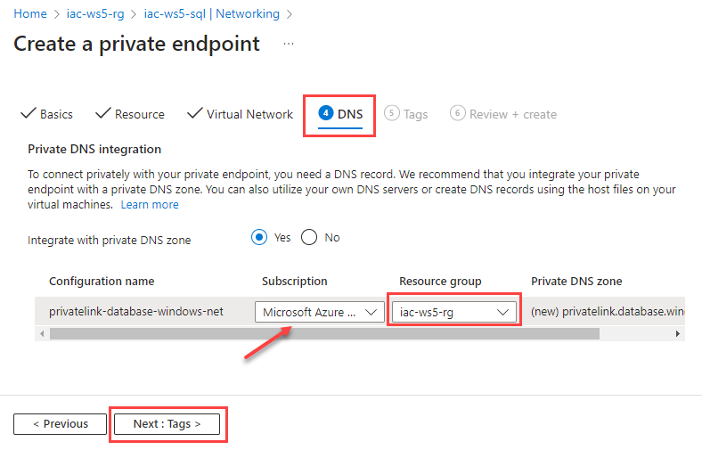
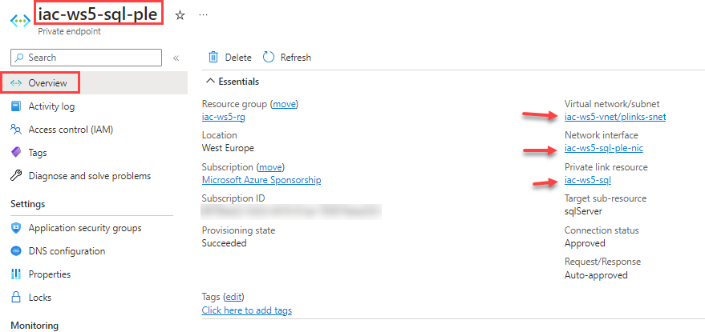
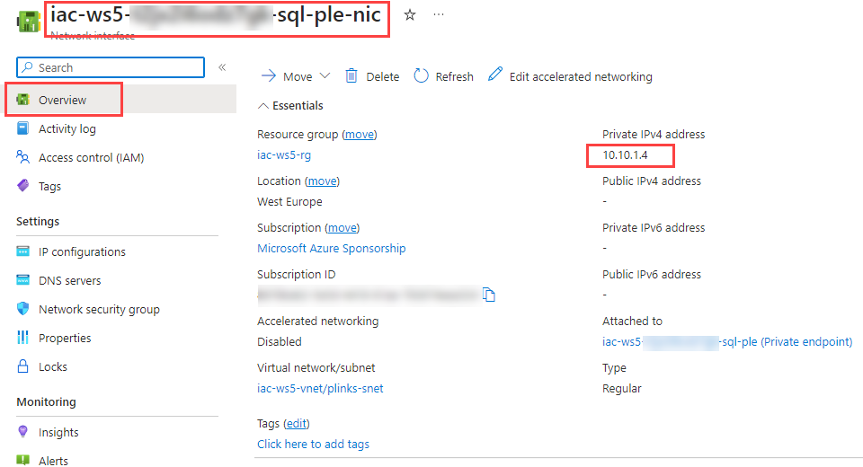
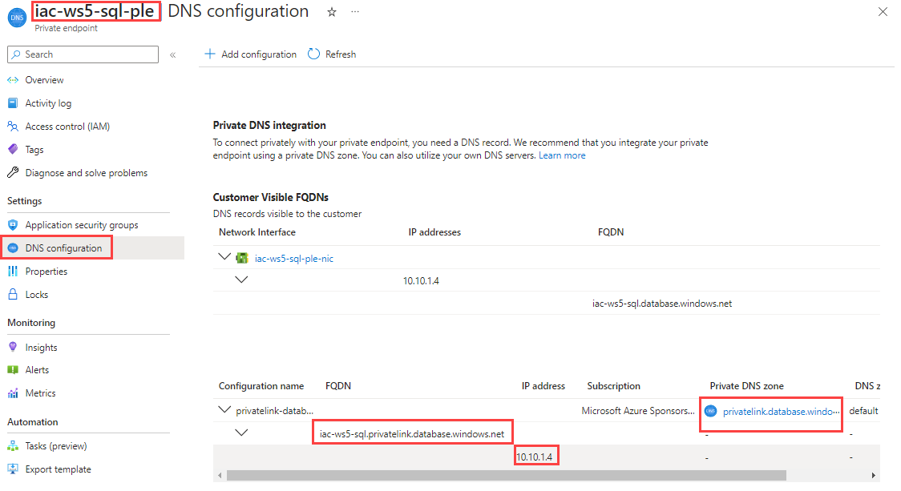
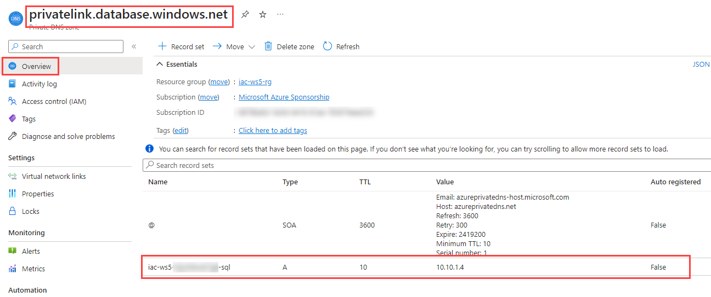

# lab-02 - create a private endpoint for Azure SQL using Azure Portal

There are several ways you can create Azure Private Endpoint. You can use Azure Portal, Azure CLI, Azure PowerShell, ARM templates, or Bicep.
In this lab, we'll use Azure POrtal to create a private endpoint for Azure SQL Server.

## Task #1 - create a private endpoint

In the Azure portal, search for and select `iac-ws5-sql` instance of Azure SQL Server. Navigate to `Security -> Networking -> Private access` and click on `+ Create private endpoint` button.



At the `Create a private endpoint -> Basic` tab, fill in the following parameters:

| Parameter | Value |
|---|---|
| Subscription | your subscription |
| Resource group | `iac-ws5-rg` |
| Name | `iac-ws5-sql-ple` |
| Network Interface Name | `iac-ws5-sql-ple-nic` |
| Region | `West Europe` | 



Click on `Next: Resource >` button and select `sqlServer` as a `Target sub-resource` parameter under `Resource` tab:



Click on `Next: Virtual Network >` button and fill in the following parameters under `Virtual Network` tab:

| Parameter | Value |
|---|---|
| Virtual network | `iac-ws5-vnet` |
| Subnet | `plinks-snet` |

Keep the rest of parameters as default.


Click on `Next: DNS >` button and set the following parameters under `DNS` tab:

| Parameter | Value |
|---|---|
| Subscription | You subscription   |
| Resource group | `iac-ws5-rg` |



Click on `Next: Tags >` button, skip this step (or add tags if you want to), and click on `Next: Review + create >` button.

It will do a validation check and if everything is valid, click on `Create` button to create a private endpoint. If there re some validation errors, fix them and try again.


It will take a few minutes to deploy private endpoint. 

## Task #2 - check what was deployed

Open `iac-ws5-sql-ple` private endpoint resource and check information under `Overview` tab:



From here we can see that private endpoint is associated with `iac-ws5-sql` instance of Azure SQL Server, it uses `iac-ws5-ple-nic` Network interface that is deployed into `plinks-snet` subnet in `iac-ws5-vnet` virtual network.

Now, open `iac-ws5-sql-ple-nic` network interface resource and check information under `Overview` tab:



Here we can find what private IP was assigned to the private endpoint. In my case, it was `10.10.1.4`. The same information you can find under `Connected devices` tab of `iac-ws5-vnet` Virtual network resource:


Back to `iac-ws5-sql-ple` private endpoint resource and check information under `DNS configuration` tab:



What we can see here is that SQL Server instance is now has `iac-ws5-sql.privatelink.database.windows.net` FQDN which will be resolved with `10.10.1.4` IP address.

Finally, open `privatelink.database.windows.net` Private DNS Zone resource and check information under `Overview` tab:



Here you can see that a new A-record was created for `iac-ws5-sql` instance pointing to IP address of `iac-ws5-sql-ple-nic` network interface.

## Task #3 - resolve private endpoint

RDP into testVM, open PowerShell console, and run the following command:

```powershell
nslookup iac-ws5-sql.database.windows.net
```

You'll receive a message similar to what is displayed below:

```powershell
Server:  UnKnown
Address:  168.63.129.16

Non-authoritative answer:
Name:    iac-ws5-sql.privatelink.database.windows.net
Address:  10.10.1.4
Aliases:  iac-ws5-sql.database.windows.net
```

As you can see from test VM it resolves `iac-ws5-sql.database.windows.net` to private IP address of Azure SQL Server instance.

Run the same command from your PC and check the output. 

```powershell
nslookup iac-ws5-sql.database.windows.net
```	

You'll receive a message similar to what is displayed below:

```powershell
Server:  dnscache01.get.no
Address:  80.232.93.171

Non-authoritative answer:
Name:    cr4.westeurope1-a.control.database.windows.net
Address:  104.40.168.105
Aliases:  iac-ws5-sql.database.windows.net
          iac-ws5-sql.privatelink.database.windows.net
          dataslice9.westeurope.database.windows.net
          dataslice9westeurope.trafficmanager.net
```

As you can see, from your PC it resolves `iac-ws5-sql.database.windows.net` to public IP address of Azure SQL Server instance. 
