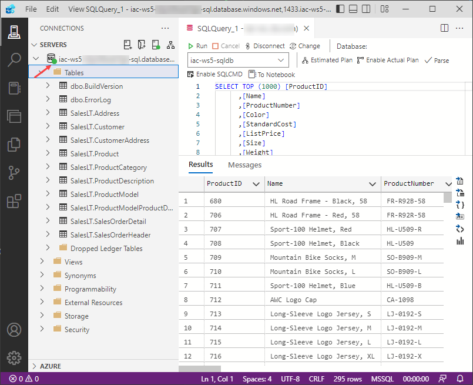
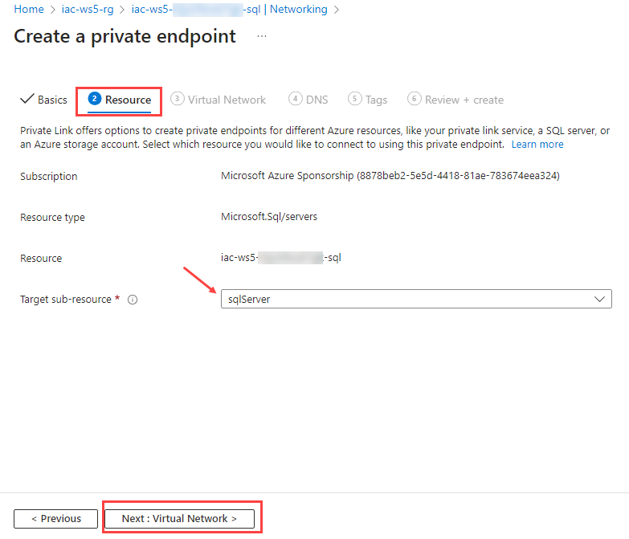
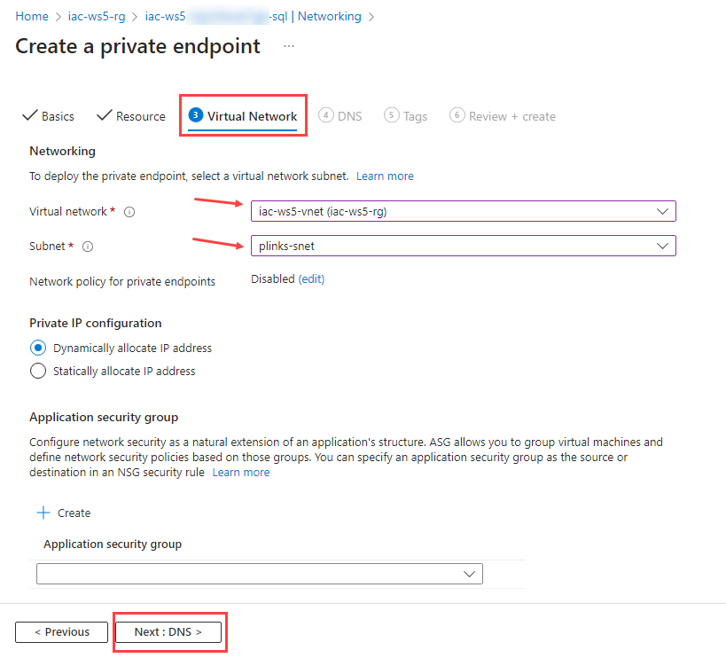
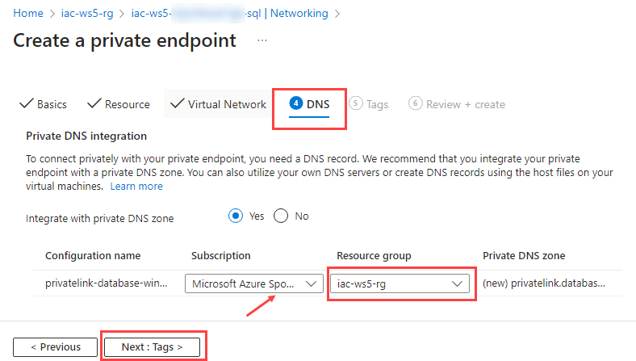
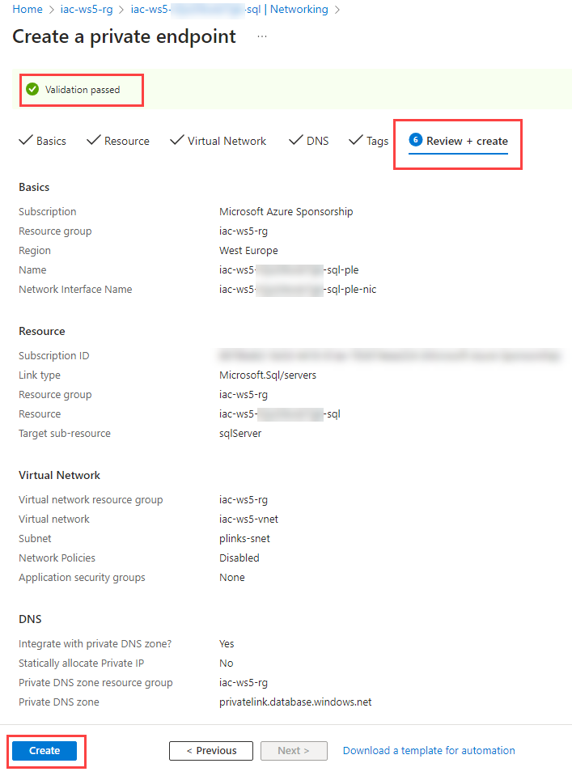
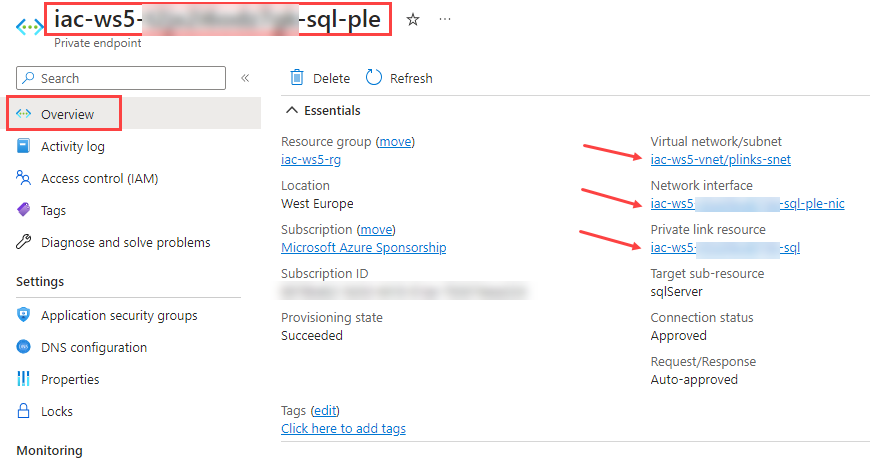
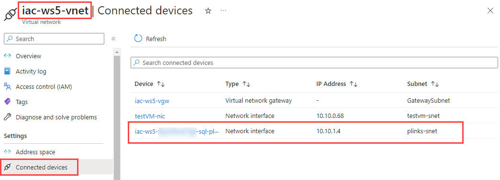
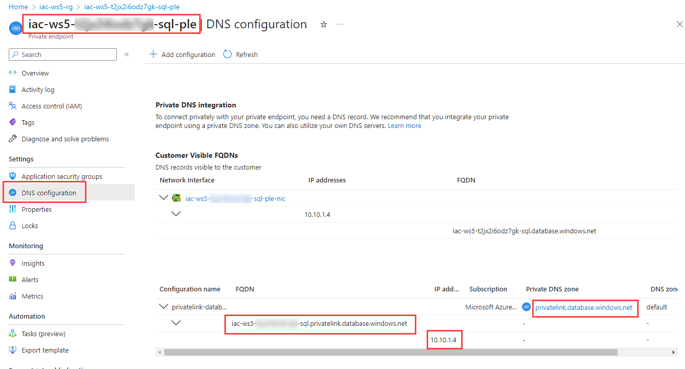
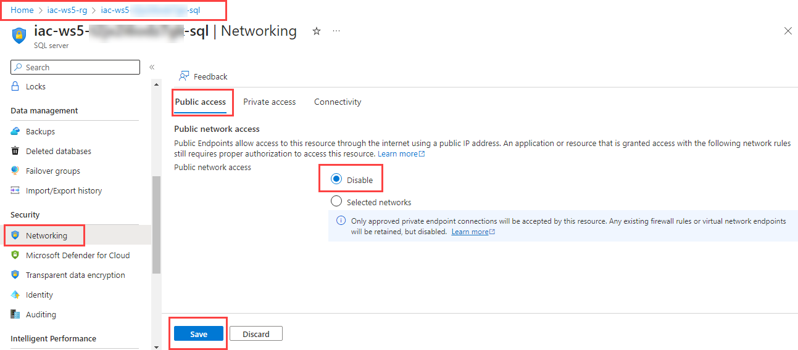
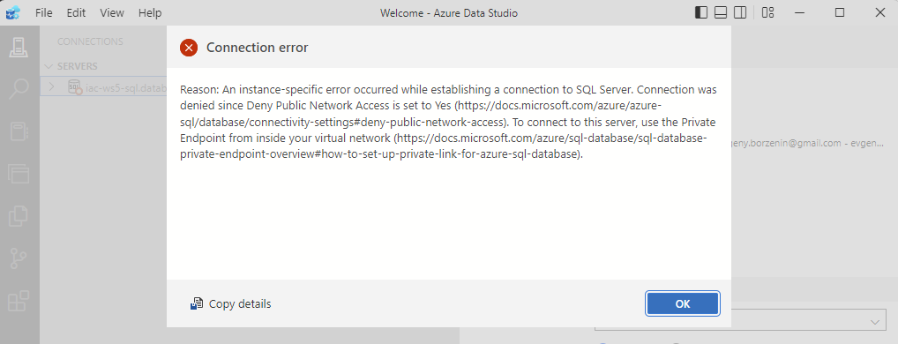

# lab-02 - create a private endpoint for Azure SQL using Azure Portal

There are several ways you can create Azure Private Endpoint. You can use Azure Portal, Azure CLI, Azure PowerShell, ARM templates, or Bicep.
In this lab, we'll use Azure POrtal to create a private endpoint for Azure SQL Server.

## Task #1 - test connectivity to SQL Server

If you already created a connection to Azure SQL Server in Azure Data Studio (`Task #6` of [lab-01](../lab-01/index.md)), use one. Otherwise, create a new connection to Azure SQL Server and connect to it. You should be able to connect to Azure SQL Server.



## Task #2 - create a private endpoint

In the Azure portal, search for and select `iac-ws5-sql` instance of Azure SQL Server. Navigate to `Security -> Networking -> Private access` and click on `+ Create private endpoint` button.


At the `Create a private endpoint -> Basic` tab, fill in the following parameters:

| Parameter | Value |
|---|---|
| Subscription | your subscription |
| Resource group | `iac-ws5-rg` |
| Name | `iac-ws5-sql-ple` |
| Network Interface Name | `iac-ws5-sql-ple-nic` |
| Region | `West Europe` | 


Click on `Next: Resource >` button and select `sqlServer` as a `Target sub-resource` parameter under `Resource` tab:



Click on `Next: Virtual Network >` button and fill in the following parameters under `Virtual Network` tab:

| Parameter | Value |
|---|---|
| Virtual network | `iac-ws5-vnet` |
| Subnet | `plinks-snet` |

Keep the rest of parameters as default.



Click on `Next: DNS >` button and set the following parameters under `DNS` tab:

| Parameter | Value |
|---|---|
| Subscription | You subscription   |
| Resource group | `iac-ws5-rg` |



Click on `Next: Tags >` button, skip this step (or add tags if you want to), and click on `Next: Review + create >` button.

It will do a validation check and if everything is valid, click on `Create` button to create a private endpoint. If there re some validation errors, fix them and try again.



It will take a few minutes to deploy private endpoint. 

## Task #3 - check what was deployed

Open `iac-ws5-sql-ple` private endpoint resource and check information under `Overview` tab:



From here we can see that private endpoint is associated with `iac-ws5-sql` instance of Azure SQL Server, it uses `iac-ws5-ple-nic` Network interface that is deployed into `plinks-snet` subnet in `iac-ws5-vnet` virtual network.

Now, open `iac-ws5-sql-ple-nic` network interface resource and check information under `Overview` tab:


Here we can find what private IP was assigned to the private endpoint. In my case, it was `10.10.1.4`. The same information you can find under `Connected devices` tab of `iac-ws5-vnet` Virtual network resource:



Back to `iac-ws5-sql-ple` private endpoint resource and check information under `DNS configuration` tab:



What we can see here is that SQL Server instance is now has `iac-ws5-sql.privatelink.database.windows.net` FQDN which will be resolved with `10.10.1.4` IP address.

Finally, open `privatelink.database.windows.net` Private DNS Zone resource and check information under `Overview` tab:


Here you can see that a new A-record was created for `iac-ws5-sql` instance pointing to IP address of `iac-ws5-sql-ple-nic` network interface.

## Task #4 - resolve private endpoint

RDP into testVM, open PowerShell console, and run the following command:

```powershell
nslookup iac-ws5-sql.database.windows.net
```

You'll receive a message similar to what is displayed below:

```powershell
Server:  UnKnown
Address:  168.63.129.16

Non-authoritative answer:
Name:    iac-ws5-sql.privatelink.database.windows.net
Address:  10.10.1.4
Aliases:  iac-ws5-sql.database.windows.net
```

As you can see from test VM the `iac-ws5-sql.database.windows.net` is resolved to private IP address of Azure SQL Server instance via `iac-ws5-sql.privatelink.database.windows.net` alias. 
This is because this VM is deployed on Azure and uses default Azure DNS server (`168.63.129.16`) and it knows about `privatelink.database.windows.net` Private DNS Zone and therefore can resolve `iac-ws5-sql.database.windows.net` to private IP address.

Run the same command from your PC and check the output. 

```powershell
nslookup iac-ws5-sql.database.windows.net
```	

You'll receive a message similar to what is displayed below:

```powershell
Server:  dnscache01.get.no
Address:  80.232.93.171

Non-authoritative answer:
Name:    cr4.westeurope1-a.control.database.windows.net
Address:  104.40.168.105
Aliases:  iac-ws5-sql.database.windows.net
          iac-ws5-sql.privatelink.database.windows.net
          dataslice9.westeurope.database.windows.net
          dataslice9westeurope.trafficmanager.net
```

As you can see, from your PC `iac-ws5-sql.database.windows.net` is resolved to public IP address of Azure SQL Server instance. 
Since your PC uses either your internal home DNS server or DNS server of your internet provider, it doesn't know anything about `privatelink.database.windows.net` Private DNS Zone and therefore resolves `iac-ws5-sql.database.windows.net` to known public IP.  

## Task #4 - disable public access to Azure SQL server

Assume you would like to disable all public access to your Azure SQL server, and only allow connections from your virtual network.

Navigate to `Networking` page of `iac-ws5-sql` instance of Azure SQL Server, select `Public access` tab, then select `Disable` for `Public network access`.



Back to Azure Data Studio and try to reconnect to `iac-ws5-sql.database.windows.net` instance. You'll receive an error message similar to this one:




## Task #5 (optional) - test connectivity to SQL server from the testVM

Remote into the testVM, download and install [Azure Data Studio](https://docs.microsoft.com/en-us/sql/azure-data-studio/download-azure-data-studio?view=sql-server-ver15&WT.mc_id=AZ-MVP-5003837) and add new connection to `iac-ws5-sql.database.windows.net` instance of Azure SQL Server as described at `Task #6` of [lab-01](../lab-01/index.md). 

You should be able to connect to the SQL server instance from the testVM via private endpoint.

## Task #6 - use hosts file to resolve private endpoint

Edit `c:\Windows\System32\Drivers\etc\hosts` (or `/etc/hosts` on Linux) file on your PC and add the following line. Note that you need to use your private IP address of SQL Server private endpoint.

```text
10.10.1.4 iac-ws5-sql.database.windows.net
```

Save `hosts` file. 

Now try to resolve `iac-ws5-sql.database.windows.net` from your PC. 

```powershell
nslookup iac-ws5-sql.database.windows.net
```

if you are on windows, `nslookup` will still resolve it to the public IP address (somehow it doesn't read configuration from `hosts` file). But `Resolve-DnsName` powershell command does.

```powershell
Resolve-DnsName iac-ws5-sql.database.windows.net
```

```powershell
Name                                           Type   TTL   Section    IPAddress
----                                           ----   ---   -------    ---------
iac-ws5-sql.database.windows.net               A      82234 Answer     10.10.1.4
```

Now, make sure that your Azure VPN connection is established, and try to reconnect to `iac-ws5-sql.database.windows.net` from Azure Data Studio. You'll be able to connect.

## Task #7 - cleaning up

Disconnect from Azure SQL Server instance and delete what you have added into `hosts` file.

Check that `iac-ws5-sql.database.windows.net` is now resolved to public IP address.

```powershell
Resolve-DnsName iac-ws5-sql.database.windows.net
```
