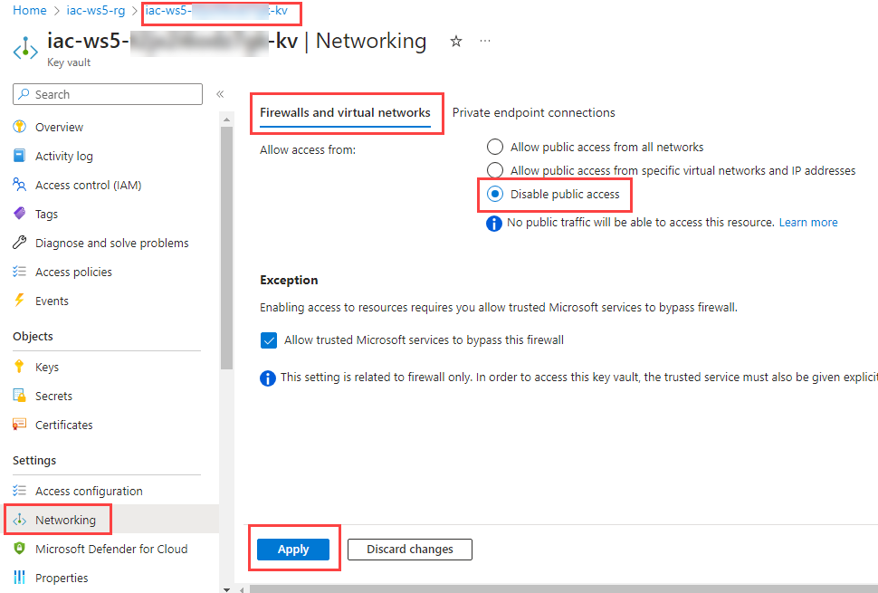

# lab-03 - create a private endpoint for Azure KeyVault using Bicep

There are several ways you can create Azure Private Endpoint. Previous lab demonstrated how to create it using Azure Portal. In this lab, we'll use Bicep to create a private endpoint for Azure KeyVault.

## Task #1 - implement Bicep template

Create new file `keyvaultPrivateEndpoint.bicep` with the following content:

```bicep
param location string = resourceGroup().location
param prefix string = 'iac-ws5'

var uniqueStr = uniqueString(subscription().subscriptionId, resourceGroup().id)
var kvName = '${prefix}-${uniqueStr}-kv'

var pleName = '${kvName}-ple'

resource kv 'Microsoft.KeyVault/vaults@2023-02-01' existing = {
  name: kvName
}

var virtualNetworkName = '${prefix}-vnet'
resource vnet 'Microsoft.Network/virtualNetworks@2022-11-01' existing = {
  name: virtualNetworkName
}

var privateDnsZoneName = 'privatelink.vaultcore.azure.net' 

resource privateDnsZone 'Microsoft.Network/privateDnsZones@2020-06-01' = {
  name: privateDnsZoneName
  location: 'global'
}

resource privateDnsZoneVnetLink 'Microsoft.Network/privateDnsZones/virtualNetworkLinks@2020-06-01' = {
  name: uniqueString(vnet.id)
  parent: privateDnsZone
  location: 'global'
  properties: {
    registrationEnabled: false
    virtualNetwork: {
      id: vnet.id
    }
  }  
}

var groupName = 'vault'
resource privateEndpoint 'Microsoft.Network/privateEndpoints@2022-09-01' = {
  name: pleName
  location: location
  properties: {
    privateLinkServiceConnections: [
      {
        name: pleName
        properties: {
          groupIds: [
            groupName
          ]
          privateLinkServiceId: kv.id
        }
      }
    ]
    subnet: {
      id: '${vnet.id}/subnets/plinks-snet'
    }
  }
}

resource privateEndpointDns 'Microsoft.Network/privateEndpoints/privateDnsZoneGroups@2022-09-01' = {
  name: '${groupName}-PrivateDnsZoneGroup'
  parent: privateEndpoint
  properties:{
    privateDnsZoneConfigs: [
      {
        name: privateDnsZoneName
        properties:{
          privateDnsZoneId: privateDnsZone.id
        }
      }
    ]
  }
}
```

Save the file and deploy it using the following command:

```powershell
# Deploy the Bicep template
az deployment group create -g iac-ws5-rg --template-file .\keyvaultPrivateEndpoint.bicep -n 'Deploy-KeyVault-PrivateEndpoint'
```

It will deploy the following Azure resources:

- [Microsoft.Network/privateEndpoints](https://learn.microsoft.com/en-us/azure/templates/microsoft.network/privateendpoints): The private endpoint that you use to access the instance of Azure KeyVault.
- [Microsoft.Network/privateDnsZones](https://learn.microsoft.com/en-us/azure/templates/microsoft.network/privatednszones): The zone that you use to resolve the private endpoint IP address. In our case it's `privatelink.vaultcore.azure.net`
- [Microsoft.Network/privateDnsZones/virtualNetworkLinks](https://learn.microsoft.com/en-us/azure/templates/microsoft.network/privatednszones/virtualnetworklinks): The virtual network link that you use to associate the private DNS zone with a virtual network.
- [Microsoft.Network/privateEndpoints/privateDnsZoneGroups](https://learn.microsoft.com/en-us/azure/templates/microsoft.network/privateendpoints/privateDnsZoneGroups): The zone group that you use to associate the private endpoint with a private DNS zone. In our case it's `vault`

## Task #2 - resolve private endpoint

First, get your KeyVault name. KeyVault name is unique, so the name of the KeyVault will be different for you. You can get the name using the following command:

```powershell
az keyvault list -g iac-ws5-rg --query '[].name' -o tsv
```

Connect to your testVM using RDP, open PowerShell console and try to resolve the Azure KeyVault DNS name:

```powershell
nslookup 'YOUR-KEYVAULT-NAME.vault.azure.net'
```

You'll see response similar to what is displayed below:

```text
Server:  UnKnown
Address:  168.63.129.16

Non-authoritative answer:
Name:    iac-ws5-...-kv.privatelink.vaultcore.azure.net
Address:  10.10.1.5
Aliases:  iac-ws5-...-kv.vault.azure.net
```

Now, try to resolve it from your PC. 


```powershell
$keyvaultName = (az keyvault list -g iac-ws5-rg --query '[].name' -o tsv)
nslookup "$keyvaultName.vault.azure.net"
```	

You'll receive message similar to what is displayed below:

```powershell
Server:  UnKnown
Address:  168.63.129.16

Non-authoritative answer:
Name:    azkms-prod-weu-a.westeurope.cloudapp.azure.com
Address:  20.61.103.228
Aliases:  iac-ws5-...-kv.vault.azure.net
          data-prod-weu.vaultcore.azure.net
          data-prod-weu-region.vaultcore.azure.net
```

As with private endpoint for SQL server, from your PC `YOUR-KEYVAULT.vault.azure.net` is resolved to public IP address and from testVM it's resolved to private IP address of KeyVault instance. 
This is because your PC doesn't use Azure DNS server and doesn't know anything about `privatelink.vaultcore.azure.net` Private DNS Zone.  

## Task #3 - disable public access to Azure keyVault

First, let's check that you can access Azure KeyVault from your PC and from testVM. 

From your PC, run the following command to get list of secrets:

```powershell
$keyvaultName = (az keyvault list -g iac-ws5-rg --query '[].name' -o tsv)
az keyvault secret list --vault $keyvaultName
```

RDP to the testVM, open PowerShell and run the same command:

```powershell
az keyvault secret list --vault YOUR-KEYVAULT-NAME
```

You should be able to get (an empty) list of secrets from both locations.

Now, let's disable public access to the keyVault. Navigate to `Networking->Firewalls and virtual networks` tab of KeyVault instance and select `Disable public access` for `Allow access from...`. Click `Apply`.




Now, try to get list of secrets again. From your PC, run the following command:

```powershell

```powershell
az keyvault secret list --vault $keyvaultName
```

You'll receive an error similar to what is displayed below:

```txt
(Forbidden) Public network access is disabled and request is not from a trusted service nor via an approved private link.
Inner error: {
    "code": "ForbiddenByConnection"
}    
```

Try to re-run the same command from testVM. 

```powershell
az keyvault secret list --vault YOUR-KEYVAULT-NAME
```

You will still be able to get list of secrets. This is because testVM uses private endpoint to access Azure KeyVault.

At the next lab we will deploy `Azure Private DNS resolver` and configure Azure VPN client to be able resolve private endpoints from your PC.