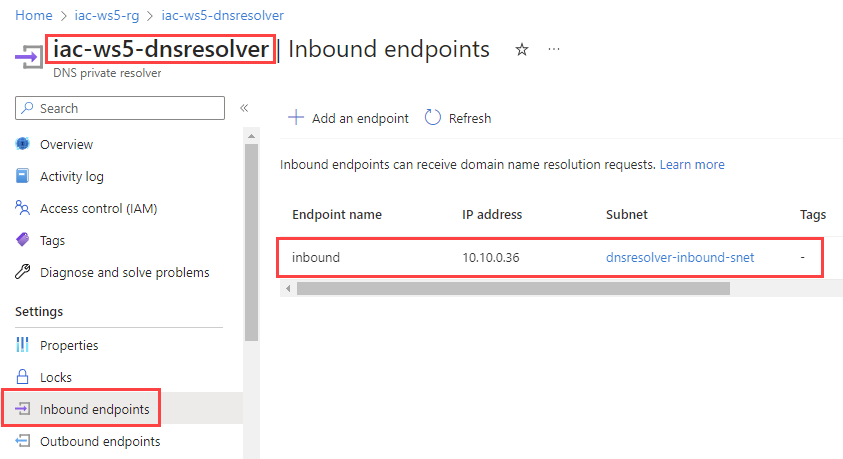
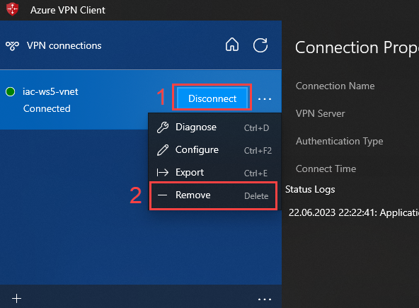
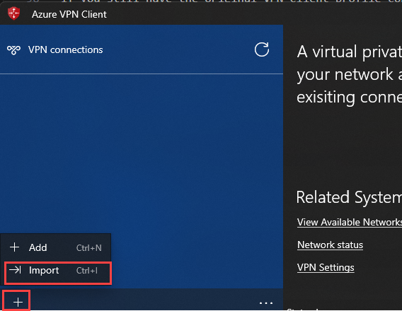
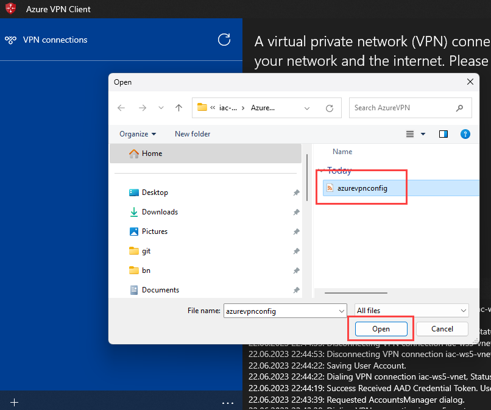
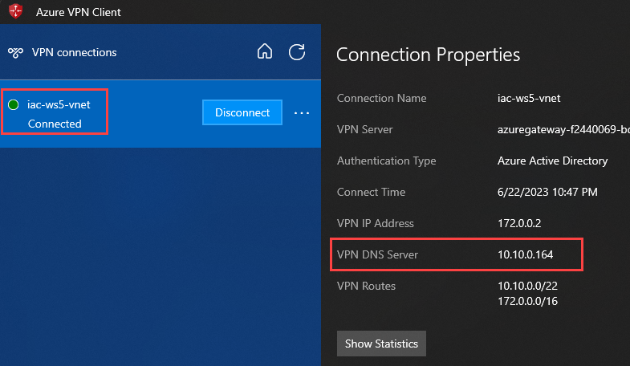

# lab-04 - deploy Private DNS Resolver using Bicep

Azure DNS Private Resolver is a service that enables you to query Azure DNS private zones from an on-premises environment (and vice versa) without deploying VM based DNS servers. 

In this lab:

- your PC will be an "on-premises environment" which is connected to the Azure virtual network via Point-to-site VPN. 
- we will only be using [Inbound endpoints](https://learn.microsoft.com/en-us/azure/dns/dns-private-resolver-overview#inbound-endpoints) (i.e. DNS resolution from on-premises to Azure).

The architecture for Azure DNS Private Resolver is summarized in the following figure. 


## Task #1 - deploy Private DNS Resolver with Bicep

Create a new file called `dnsPrivateResolver.bicep` with the following content:

```bicep
param location string = resourceGroup().location
param prefix string = 'iac-ws5'

var virtualNetworkName = '${prefix}-vnet'

resource vnet 'Microsoft.Network/virtualNetworks@2022-11-01' existing = {
  name: virtualNetworkName
}

var dnsResolverName = '${prefix}-dnsresolver'

resource dnsResolver 'Microsoft.Network/dnsResolvers@2022-07-01' = {
  name: dnsResolverName
  location: location
  properties: {
    virtualNetwork: {
      id: vnet.id
    }
  }
}

resource inboundEndpoint 'Microsoft.Network/dnsResolvers/inboundEndpoints@2022-07-01' = {
  name: 'inbound'
  parent: dnsResolver
  location: location
  properties: {
    ipConfigurations: [
      {
        subnet: {
          id: '${vnet.id}/subnets/dnsresolver-inbound-snet'
        }
        privateIpAllocationMethod: 'Dynamic'
      }
    ]
  }
}
```

This template contains two resources:
- `Microsoft.Network/dnsResolvers` - this is the main resource for the Private DNS Resolver. Note that it requires a virtual network to be specified.
- `Microsoft.Network/dnsResolvers/inboundEndpoints` - inbound endpoint. Note that it requires a subnet to be specified.

Save the file and deploy it using the following command:

```powershell
az deployment group create -g iac-ws5-rg --template-file .\dnsPrivateResolver.bicep -n 'Deploy-PrivateDNSResolver'
```

Goto the Azure portal and verify that the Private DNS Resolver `iac-ws5-dnsresolver` has been deployed and check inbounds endpoint configuration.



Note the private IP address assigned to the inbound endpoint. 
You can also get this IP using `az cli`:

```powershell
az dns-resolver inbound-endpoint show --dns-resolver-name iac-ws5-dnsresolver --name inbound --resource-group iac-ws5-rg --query ipConfigurations[0].privateIpAddress -o tsv
```

## Task #2 - configure DNS server for Azure VPN Client

In this task we will configure the DNS server for Azure VPN Client. 

Before we do that, let's double check that both Azure KeyVault and SQL Server are still resolved to their public IP addresses:

```powershell
# Azure KeyVault
$keyvaultName = (az keyvault list -g iac-ws5-rg --query '[].name' -o tsv)
Resolve-DnsName "$keyvaultName.vault.azure.net"

# SQL Server
$sqlServerName = (az sql server list -g iac-ws5-rg --query [0].name -o tsv)
Resolve-DnsName "$sqlServerName.database.windows.net"
```

Now, open Azure VPN CLient, disconnect your active connection and then remove it.



If you still have the original VPN client profile configuration file, use it. If you can't find it, download it again as described at [Task #4 of lab-01](../lab-01/index.md#task-4-configure-azure-vpn-client). 

Open `iac-ws5-vgw\AzureVPN\azurevpnconfig.xml` file (most likely under `Downloads` folder).

Add the following block under `<clientconfig i:nil="true" >` section:

```xml
<clientconfig i:nil="true" >
    <dnsservers>
        <dnsserver>YOUR-DNS-RESOLVER-INBOUND-ENDPOINT-IP</dnsserver>
    </dnsservers>
</clientconfig>
```

Use your Private DNS Resolver inbound endpoint IP address from `Task #1`. 

Save the file and import it back to Azure VPN Client.





Connect to the VPN. Most likely you will be asked to authenticate towards Azure AD again. When connected check the `Connection Properties` and verify that the DNS server is set to your Private DNS Resolver inbound endpoint IP address.



Now, try to resolve Azure KeyVault and SQL Server FQDNs again:

```powershell
# Azure KeyVault
$keyvaultName = (az keyvault list -g iac-ws5-rg --query '[].name' -o tsv)
Resolve-DnsName "$keyvaultName.vault.azure.net"

# SQL Server
$sqlServerName = (az sql server list -g iac-ws5-rg --query [0].name -o tsv)
Resolve-DnsName "$sqlServerName.database.windows.net"
```

Both should be resolved to their private IP addresses.

## Task #3 - test connectivity to Azure KeyVault and SQL Server

Try to get secrets from the Azure KeyVault:

```powershell
$keyvaultName = (az keyvault list -g iac-ws5-rg --query '[].name' -o tsv)
az keyvault secret list --vault-name $keyvaultName
```

From the Azure Data Studio, try to connect to your SQL Server.

## Links

- [What is Azure DNS Private Resolver?](https://learn.microsoft.com/en-us/azure/dns/dns-private-resolver-overview)
- [Azure DNS Private Resolver - Azure Example Scenarios](https://learn.microsoft.com/en-us/azure/architecture/example-scenario/networking/azure-dns-private-resolver)
- [Microsoft.Network dnsResolvers](https://learn.microsoft.com/en-gb/azure/templates/microsoft.network/dnsresolvers?pivots=deployment-language-bicep)
- [Quickstart: Create an Azure DNS Private Resolver using the Azure portal](https://learn.microsoft.com/en-us/azure/dns/dns-private-resolver-get-started-portal)
- [Azure DNS Private Resolver Deep Dive](https://www.youtube.com/watch?v=V8ChsYAyxTc)

