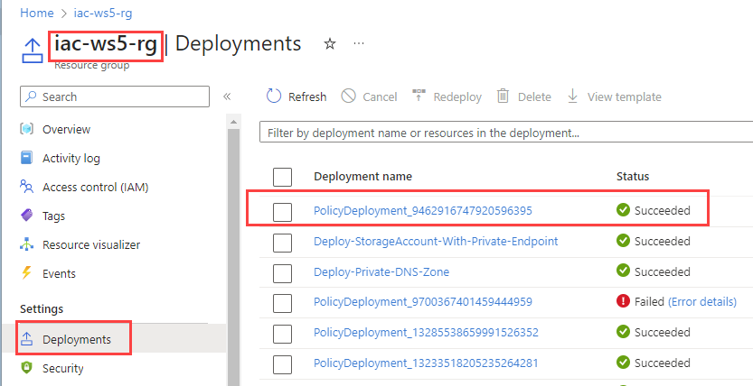
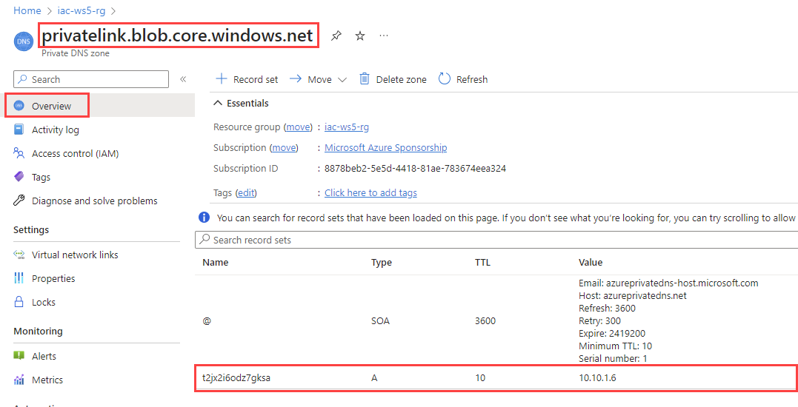

# lab-05 - Using Azure Policy to Create DNS Records for Private Endpoints (storage account)

As we already learned, Azure Private Link allows us to access Azure PaaS services over a private endpoint in virtual network. To make Azure PaaS resources accessible via Private link, we will need to:

- Create a private endpoint in the virtual network.
- Create a DNS record for the private endpoint on the specific Azure Private DNS Zone for the particular Private Link service

If you are operating under Azure Landing Zone Enterprise Scale architecture, your workload teams may hit the challenge of registering DNS records for the private endpoints because of security permissions. 

The private DNS zones are typically deployed under Connectivity Landing Zone (aka Subscription). The Workload team will typically use Service Principal that is scoped with Contributor role at the scope of the workload subscription (or Resource Group). However, the Service Principal will not have permissions to create DNS records in the private DNS zone under Connectivity subscription and we don’t really want to assign this permission to every Workloads that need to create private endpoints. 

In addition to that we also want to simplify the process of creating Private Endpoints for Workload owners, since they may not know which Private DNS zones are required for their services. 

One of the solutions is to use Azure policy to automatically create the DNS records for the Private Endpoints to appropriate Private DNS zones using `DeployIfNotExists` effect.

In this lab we will create Azure Policy to create DNS record for the private endpoints for Azure Storage Account.

In this lab, we will be using Azure PowerShell module, so, before you start, make sure that the latest version is installed. See [Install Azure PowerShell module](https://learn.microsoft.com/en-us/powershell/azure/install-azure-powershell) for detailed information.

## Task #1 - Create Azure Private DNS Zone for Blob (privatelink.blob.core.windows.net) using Bicep

Create new Bicep file called `privateDNS.bicep` with the following content:

```bicep 
param prefix string = 'iac-ws5'

var virtualNetworkName = '${prefix}-vnet'
resource vnet 'Microsoft.Network/virtualNetworks@2022-11-01' existing = {
  name: virtualNetworkName
}

var privateDnsZoneName = 'privatelink.blob.${environment().suffixes.storage}' 

resource privateDnsZone 'Microsoft.Network/privateDnsZones@2020-06-01' = {
  name: privateDnsZoneName
  location: 'global'
}

resource privateDnsZoneVnetLink 'Microsoft.Network/privateDnsZones/virtualNetworkLinks@2020-06-01' = {
  name: uniqueString(vnet.id)
  parent: privateDnsZone
  location: 'global'
  properties: {
    registrationEnabled: false
    virtualNetwork: {
      id: vnet.id
    }
  }  
}
```

Save the file and deploy it: 

```powershell
az deployment group create -g iac-ws5-rg --template-file .\privateDNS.bicep -n 'Deploy-Private-DNS-Zone'
```

It will create new Private DNS zone `privatelink.blob.core.windows.net` for Blob storage and link it to `iac-ws5-vnet` virtual network.

## Task #2 - Create Azure Policy Definition

Next, deploy Azure Policy Definition for policy that will automatically create the DNS records under `privatelink.blob.core.windows.net` private DNS Zone for the Storage Account Private Endpoint. 
The policy definition is stored in `deploy-sa-blob-ple-dns-records.json` file.

```powershell	
New-AzPolicyDefinition -Name 'deploy-sa-blob-ple-dns-records' -DisplayName 'Deploy Storage Account Blob Private Endpoint DNS Record' -Policy 'deploy-sa-blob-ple-dns-records.json'
```

## Task #3 - assign Azure Policy Definition

To get a better understanding of how Azure Policy assignment works, we will manually assign the policy definition from the portal. In the real world scenario, you will typically assign the policy definition with IaC.


## Task #4 - implement and deploy Storage Account with Private Endpoint for Blob storage

Create new Bicep file called `sa.bicep` with the following content:

```bicep
param location string = resourceGroup().location
param prefix string = 'iac-ws5'

var uniqueStr = uniqueString(subscription().subscriptionId, resourceGroup().id)
var saName = '${uniqueStr}sa'

var pleName = '${saName}-ple'

var virtualNetworkName = '${prefix}-vnet'
resource vnet 'Microsoft.Network/virtualNetworks@2022-11-01' existing = {
  name: virtualNetworkName
}

resource sa 'Microsoft.Storage/storageAccounts@2022-09-01' = {
  name: saName
  location: location
  sku: {
    name: 'Standard_LRS'
  }
  kind: 'StorageV2'
  properties: {
    publicNetworkAccess: 'Disabled'
    minimumTlsVersion: 'TLS1_2'
    supportsHttpsTrafficOnly: true
  }
}

var groupName = 'blob'
resource privateEndpoint 'Microsoft.Network/privateEndpoints@2022-09-01' = {
  name: pleName
  location: location
  properties: {
    privateLinkServiceConnections: [
      {
        name: pleName
        properties: {
          groupIds: [
            groupName
          ]
          privateLinkServiceId: sa.id
        }
      }
    ]
    subnet: {
      id: '${vnet.id}/subnets/plinks-snet'
    }
  }
}
```

Save the file and deploy it:

```powershell	
az deployment group create -g iac-ws5-rg --template-file .\sa.bicep -n 'Deploy-StorageAccount-With-Private-Endpoint'
```

It will deploy new Storage Account with Private Endpoint for Blob storage and disabled public access. If you wait some minutes and check the Resource Group Deployments, you will find that policy has been triggered and DNS record for the Private Endpoint has been created under `privatelink.blob.core.windows.net` private DNS Zone.



If you check the Private DNS Zone `privatelink.blob.core.windows.net`, you will find that new DNS record for Storage Account blob private endpoint has been created.



## Links

- [Azure services DNS zone configuration](https://learn.microsoft.com/en-us/azure/private-link/private-endpoint-dns#azure-services-dns-zone-configuration)
- [List of all available Private Endpoints](https://learn.microsoft.com/en-us/azure/private-link/private-endpoint-overview#private-link-resource)